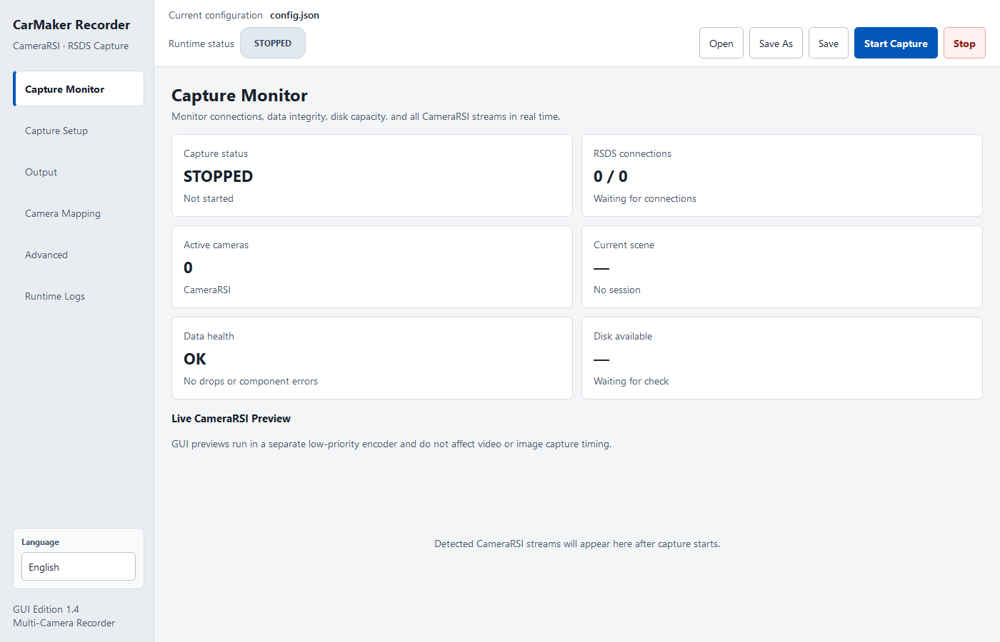

# CarMaker CameraRSI Recorder

English | [简体中文](README_CN.md)

CarMaker CameraRSI Recorder captures multiple `CameraRSI` streams from CarMaker or MovieNX over RSDS TCP. It writes segmented video and optional sampled images through either a command-line interface or a PySide6 desktop interface. Runtime telemetry, session manifests, disk protection, and persistent logs are included.

> This is an independently developed open-source project. It is not affiliated with or endorsed by IPG Automotive GmbH. CarMaker and MovieNX are trademarks of their respective owners.


## Features

- Connects to one or more RSDS ports with independent reconnection
- Records multiple cameras by CameraRSI ID
- Samples still images on CameraRSI simulation time
- Reports queue drops, writer health, throughput, and free disk space
- Starts a new video segment after resolution changes or large time gaps
- Creates an isolated output directory and `session_manifest.json` for every capture
- Provides an English and Chinese desktop interface with automatic first-run language detection and saved preferences
- Includes Windows and Linux launchers plus a portable Windows build script

## Desktop interface



## Requirements

- Python 3.10 or newer
- CarMaker or MovieNX configured to publish CameraRSI data
- CLI: NumPy and OpenCV
- GUI: PySide6 in addition to the core dependencies

## Quick start

### Windows

GUI:

```powershell
.\scripts\windows\start_gui.bat
```

CLI:

```powershell
.\scripts\windows\start_cli.bat
```

### Linux

Make the launchers executable once:

```bash
chmod +x scripts/linux/*.sh
```

Start the GUI or CLI:

```bash
./scripts/linux/start_gui.sh
./scripts/linux/start_cli.sh
```

To install and run manually:

```bash
python -m venv .venv
# Linux/macOS: source .venv/bin/activate
# Windows: .venv\Scripts\activate
python -m pip install -r requirements.txt
python run_gui.py --config config.json
```

For CLI-only use, install `requirements-core.txt` and run:

```bash
python run.py --config config.json
```

## Configuration

The default configuration is stored in `config.json`. Important sections include:

- `network.host` and `network.ports`: RSDS endpoint
- `video` and `images`: media output policy
- `output.save_root`: capture output directory
- `output.camera_names`: CameraRSI ID-to-name mapping
- `reliability`: disk thresholds, writer failure policy, and simulation-time rollback threshold

Configuration parsing follows strict schema v4 rules. Missing, unknown, and legacy fields are rejected. See the [configuration reference](docs/CONFIG_REFERENCE.md) for every field and the [multi-camera example](examples/config_remote_multi_camera.json) for a remote setup.

## Output layout

A session is created only after the first valid CameraRSI frame arrives:

```text
carmaker_videos/
├── logs/
│   └── recorder-YYYYMMDD.log
└── YYYY.MM.DD-HH_MM_SS_mmm-scene-NNNN/
    ├── Videos/
    ├── Images/
    └── session_manifest.json
```

The manifest records the effective configuration, capture time range, camera statistics, queue drops, writer state, and disk state.

## Stream integrity

- A significant simulation-time rollback on one RSDS stream stops the session to prevent two simulation runs from being mixed.
- A full ring buffer overwrites its oldest item to preserve real-time behavior while recording the drop and marking the session as degraded.
- Writer errors either stop capture or mark the session as degraded according to configuration.

See [ARCHITECTURE.md](docs/ARCHITECTURE.md) for the runtime design.

## Verification

```bash
python verify_project.py
```

This compiles the source, validates the default configuration, runs unit and integration tests, and performs an offscreen GUI smoke test when PySide6 is installed. See [VALIDATION.md](docs/VALIDATION.md) for the covered behavior.

## Offline deployment and Windows builds

Prepare offline dependencies on an internet-connected machine with the same operating system and Python architecture as the target:

```powershell
.\scripts\windows\prepare_offline.bat
```

```bash
./scripts/linux/prepare_offline.sh
```

Dependencies are downloaded into the Git-ignored `wheels/` directory. Build the portable Windows application with:

```powershell
.\scripts\windows\build.bat
```

The result is written to `dist/CarMakerCameraRecorderGUI/` and is excluded from version control.

## Repository layout

```text
├── carmaker_recorder/   # Capture core
├── carmaker_gui/        # PySide6 desktop interface
├── tests/               # Unit and integration tests
├── docs/                # Architecture, configuration, and validation notes
├── examples/            # Example configurations
├── scripts/
│   ├── windows/         # Windows launch, offline, and build scripts
│   ├── linux/           # Linux launch and offline scripts
│   └── check_repository.py
├── config.json          # Default configuration
├── run.py               # CLI entrypoint
└── run_gui.py           # GUI entrypoint
```

## Version-control scope

The repository uses an allowlist-based `.gitignore`, a pre-commit hook, and a GitHub Actions check to keep generated or private files out of commits. Enable the supplied hook after cloning:

```bash
git config core.hooksPath .githooks
```

Caches, virtual environments, captures, logs, offline packages, and build artifacts are excluded.

## License

This project is licensed under the [MIT License](LICENSE).
