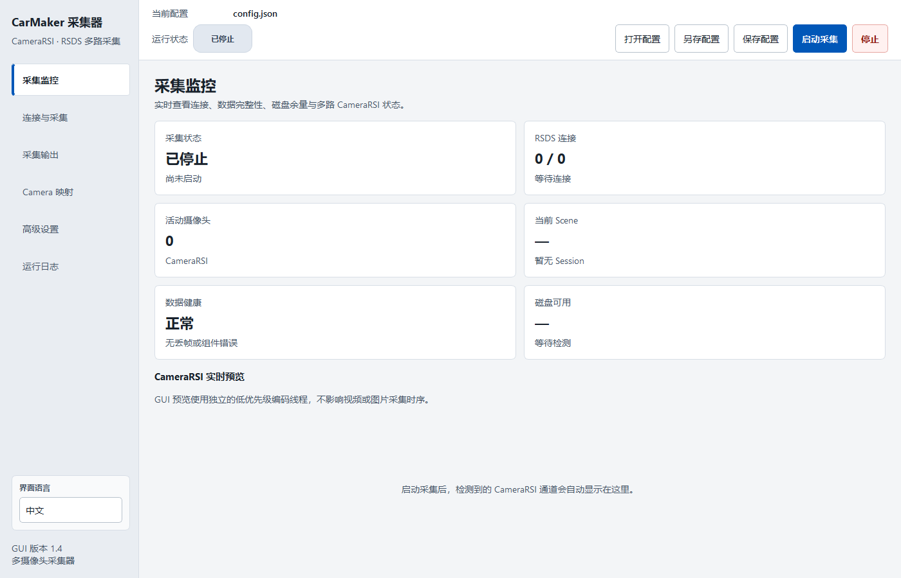

# CarMaker CameraRSI Recorder

[English](README.md) | 简体中文

CarMaker CameraRSI Recorder 通过 CarMaker / MovieNX 的 RSDS TCP 数据流采集多路 `CameraRSI`，输出分段视频和可选的采样图片。项目同时提供命令行与 PySide6 图形界面，并包含运行状态监控、会话清单、磁盘保护和持久日志。

> 本项目是独立开发的开源工具，与 IPG Automotive GmbH 无隶属或授权关系。CarMaker 和 MovieNX 是其各自权利人的商标。


## 功能

- 同时连接一个或多个 RSDS 端口，各端口独立重连
- 按 CameraRSI ID 保存多路视频和采样图片
- 在可用时通过 FFmpeg 使用 NVENC、Intel QSV 或 AMD AMF，并支持配置 OpenCV 回退
- 避免录制链路中重复复制 RSDS Payload 和原生 BGR 帧
- 根据 CameraRSI 仿真时间采样静态图片
- 记录队列丢帧、写入状态、吞吐率和磁盘余量
- 视频分辨率或时间跨度变化时自动分段
- 每次采集生成独立目录和 `session_manifest.json`
- 提供中英文图形界面，首次启动自动检测系统语言，并记住后续的语言选择
- 提供 Windows、Linux 启动脚本及 Windows 便携版构建脚本

## 图形界面



## 环境要求

- Python 3.10 或更高版本
- 已配置 CameraRSI 输出的 CarMaker / MovieNX
- 命令行模式：NumPy、OpenCV
- 图形界面：额外需要 PySide6
- 可选硬件视频编码：`PATH` 中可找到 FFmpeg，并配有受支持的 GPU 和当前驱动

## 快速开始

### Windows

图形界面：

```powershell
.\scripts\windows\start_gui.bat
```

命令行：

```powershell
.\scripts\windows\start_cli.bat
```

### Linux

首次使用前授予脚本执行权限：

```bash
chmod +x scripts/linux/*.sh
```

图形界面或命令行：

```bash
./scripts/linux/start_gui.sh
./scripts/linux/start_cli.sh
```

也可以手动创建环境并启动：

```bash
python -m venv .venv
# Linux/macOS: source .venv/bin/activate
# Windows: .venv\Scripts\activate
python -m pip install -r requirements.txt
python run_gui.py --config config.json
```

仅使用命令行时安装 `requirements-core.txt`，然后运行：

```bash
python run.py --config config.json
```

## 配置

默认配置位于 `config.json`。主要配置项包括：

- `network.host`、`network.ports`：RSDS 地址与端口
- `video`、`images`：媒体输出策略、编码器选择、编码格式和码率
- `output.save_root`：采集结果目录
- `output.camera_names`：CameraRSI ID 与输出名称映射
- `reliability`：磁盘阈值、写入失败策略和仿真时间回退阈值

配置使用严格的 schema v5；缺失字段、未知字段和旧版字段都会被拒绝。完整字段说明见 [配置参考](docs/CONFIG_REFERENCE.md)。远程多摄像头示例见 [示例配置](examples/config_remote_multi_camera.json)。

### 硬件视频编码

默认的 `video.backend` 为 `auto`。首个视频分段创建时，程序会通过 FFmpeg 依次测试所选编码格式对应的 NVENC、Intel QSV 和 AMD AMF，使用第一个实际可工作的硬件编码器。如果 FFmpeg 或兼容编码器不可用，且 `allow_cpu_fallback` 已启用，录制会继续使用 OpenCV。

```json
"video": {
  "backend": "auto",
  "codec": "h264",
  "bitrate_mbps": 12.0,
  "allow_cpu_fallback": true,
  "ffmpeg_path": "ffmpeg"
}
```

纯 CPU 部署可使用 `backend: "opencv"`；也可以选择 `nvenc`、`qsv` 或 `amf` 指定硬件类型。当录制必须使用硬件编码时，将 `allow_cpu_fallback` 设为 `false`。`fourcc` 只用于 OpenCV 路径。每路摄像头最终使用的编码后端会写入 `session_manifest.json`。

RSDS 数据仍需先进入主机内存，编码后的数据也仍需经过操作系统写入磁盘。硬件模式加速的是视频编码，不代表端到端零复制；本版本的 RGB、灰度、JPEG 和预览转换仍使用 CPU。

## 输出目录

收到第一帧有效 CameraRSI 数据后，程序才会创建采集会话：

```text
carmaker_videos/
├── logs/
│   └── recorder-YYYYMMDD.log
└── YYYY.MM.DD-HH_MM_SS_mmm-scene-NNNN/
    ├── Videos/
    ├── Images/
    └── session_manifest.json
```

`session_manifest.json` 保存本次运行配置、时间范围、摄像头统计、队列丢帧、写入状态和磁盘状态。

## 视频流完整性

- 同一 RSDS 数据流的仿真时间显著回退时，程序停止当前会话，避免混合两次仿真。
- RingBuffer 满时覆盖最旧数据以保持实时性，同时记录丢帧并将会话标记为降级。
- Writer 错误按配置停止采集或将会话标记为降级，不会静默忽略。

架构说明见 [ARCHITECTURE.md](docs/ARCHITECTURE.md)。

## 验证

```bash
python verify_project.py
```

该命令会编译源码、校验默认配置、运行单元与集成测试，并在已安装 PySide6 时执行无界面的 GUI 冒烟测试。详细范围见 [VALIDATION.md](docs/VALIDATION.md)。

## 离线部署与 Windows 构建

在与目标机操作系统及 Python 架构一致的联网电脑上准备离线依赖：

```powershell
.\scripts\windows\prepare_offline.bat
```

```bash
./scripts/linux/prepare_offline.sh
```

依赖会下载到被 Git 忽略的 `wheels/` 目录。Windows 便携版构建命令：

```powershell
.\scripts\windows\build.bat
```

产物位于 `dist/CarMakerCameraRecorderGUI/`，不会进入版本控制。

## 项目结构

```text
├── carmaker_recorder/   # 采集核心
├── carmaker_gui/        # PySide6 图形界面
├── tests/               # 单元与集成测试
├── docs/                # 架构、配置和验证说明
├── examples/            # 示例配置
├── scripts/
│   ├── windows/         # Windows 启动、离线准备与构建脚本
│   ├── linux/           # Linux 启动与离线准备脚本
│   └── check_repository.py
├── config.json          # 默认配置
├── run.py               # 命令行入口
└── run_gui.py           # 图形界面入口
```

## 版本控制范围

仓库采用允许列表式 `.gitignore`，并通过提交钩子与 GitHub Actions 检查入库文件。初始化后可执行以下命令启用随仓库提供的钩子：

```bash
git config core.hooksPath .githooks
```

缓存、虚拟环境、采集数据、日志、离线依赖和构建产物均不会进入提交。

## 许可证

本项目采用 [MIT License](LICENSE)。
